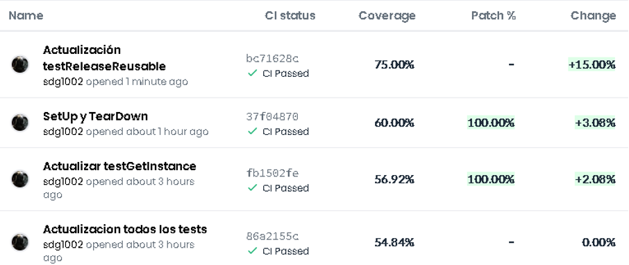
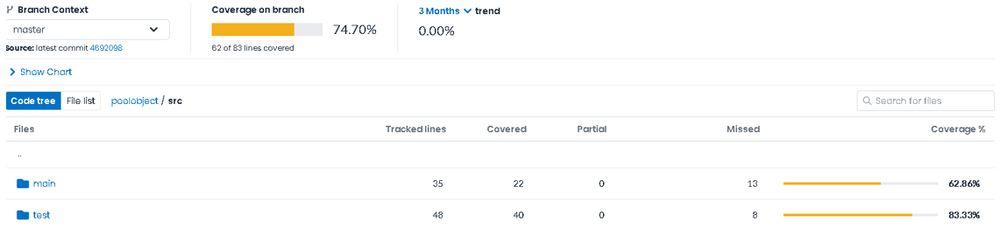
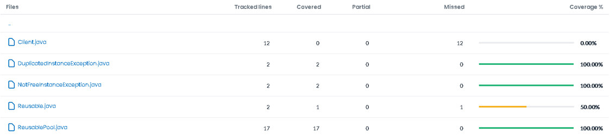
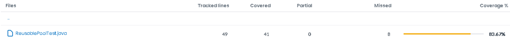

<h1 align="center">PG_C01 Monitorización del proceso de pruebas con Git-Travis-Codecov</h1>

  

## Autores:

- [Ana Salces Mansilla](https://github.com/AnaSalces)
- [Santiago Gómez Díaz-Guillamón](https://github.com/sdg1002)

## Índice

* Título
* [Autores](#Autores)
* [Índice](#Índice)
* [Objetivos de la práctica](#Objetivos-de-la-práctica) 
* [Enunciado](#Enunciado)
* [Software](#Software)

## Objetivos de la práctica

- Comprender los objetivos de medición relacionados con la caracterización y la evaluación de productos, procesos y recursos software
- Comprender, aplicar y analizar técnicas de medición sobre entidades de productos software relacionados con conjuntos de pruebas de software
- Comprender, aplicar y analizar medidas relacionadas sobre entidades de proceso y recursos de prueba del software

## Enunciado
En la práctica se va simular un pequeño desarrollo de un producto software para realizar mediciones sobre él. El objetivo es establecer un caso de estudio que sirva para caracterizar y evaluar tanto el producto
desarrollado como el proceso seguido.

  `(a) Descripción del producto`

Dado un código de ejemplo del patrón diseño creacional Pool Object, se debe crear una batería de pruebas tal que las coberturas de sus clases sean del 100%. El código de las clases se puede obtener en el repositorio
https://github.com/clopezno/poolobject . La batería de pruebas JUnit debe estar contenida en la clase ubu.gii.dass.test.c01.ReuseblePoolTest.java.

  `(b) Descripción del proceso`
  
El proceso de desarrollo de la batería de pruebas se va a gestionar utilizando el control de versiones del sistema Git proporcionado por el repositorio de proyectos GitHub ( https://github.com).
Los pasos para gestionar el procesos son los siguientes:
- 1. Cada miembro del equipo tiene que estar registrado en GitHub, Travis CI y Codecov.io.
- 2. Uno de los miembros tiene que realizar un fork del repositorio donde se encuentra el código que se quiere probar 
https://github.com/clopezno/poolobject. El nuevo repositorio tiene que ser público.
- 3. Invitar al resto de miembros del equipo para que puedan participar en el desarrollo de las pruebas.
- 4. Vincular el proyecto con Travis CI y Codecov.io.
- 5. Cada nuevo test realizado ejecutar un commit/push al repositorio del grupo. El texto del commit tiene que describir el caso de prueba añadido.
- 6. Verificar el resultado de las pruebas en el pipeline de integración continua y cómo la calidad del producto va mejorando con las sucesivas integraciones

## Preguntas

**¿Se ha realizado trabajo en equipo?**

Si se ha realizado el trabajo en equipo, ambos hemos realizado aportaciones a todas las partes de la práctica. 
Empezando por el repositorio y los servicios de pruebas como Codecov.io, hemos aprendido e investigado como utilizarlos y como trabajar sobre ellos.
Siguiendo por la creación de los test y mejoras a posteriori, en el [historial de commit de GitHub](https://github.com/sdg1002/poolobject/graphs/commit-activity) se puede ver que los dos hemos colaborado de forma significativa. 
Además de que en la segunda versión de los test, los dos hemos influido y mejorado, para conseguir una mayor cobertura. 
A parte de este fichero-informe de la práctica en el que hemos opinado y escrito ambos para poder explicar toda la cobertura de la práctica y los servicios utilizados.

**¿Tiene calidad el conjunto de pruebas disponibles?**

Para responder a esta pregunta, es necesario tener en cuenta dos apartados, el primero, que entendemos por "calidad" y el segundo que herramientas tenemos para medirlo.
  En lo referente a la calidad de nuestro conjunto de pruebas, no podemos decir que consideramos que la correcta ejecución de los test lo haría exitoso, sino que la calidad vendría de lo extensivo de la cobertura de estos tests, tanto en casos posibles, como en partes del código que se comprueban.
  Esto nos lleva a las medidas para juzgar su calidad, en este caso solo tenemos la cobertura, que hace referencia a las partes comprobadas. Esta medida, aunque muy útil no contempla algunos casos como la intención de los tests, o por ejemplo, en nuestro caso particular, el hecho de que no añadamos tests de cliente nos reduce este dato.
  Con todo ello, y dado que los casos posibles no tienen una manera objetiva de ser medidos, podría concluir con que nuestro conjunto de pruebas tiene cierta calidad (basándome en parte en la cobertura del 75% pese a cliente), pero sin embargo este nivel de calidad sería mejorable añadiendo otro set de tests para cliente y quizá añadiendo algunos casos concretos a las pruebas si tuvieramos especificaciones más claras.
  
  Por último adjunto imágenes de Codecov relativas a la cobertura a lo largo del tiempo (desde que pasamos todos los tests por primera vez), e hicimos varias mejoras, y relativas a la cobertura de cada parte.
  

<h3 align="center">Avance Temporal con los Commits</h3>
  

<h3 align="center">Porcentaje Total y de cada parte</h3>

<h3 align="center">Cobertura de las partes de la carpeta main</h3>

<h3 align="center">Cobertura de la clase test</h3>

**¿Cuál es el esfuerzo invertido en realizar la actividad?**

A lo largo de esta práctica hay que tener en cuenta dos medidas de tiempo principales.
- La primera las horas de clase: 4 horas aproximadamente.
- Y la segunda con horas fuera de clase: 8-9 horas aproximadamente.

De estas 12 horas de realización de la actividad, media hora fue la explicación durante la clase y quizas una hora u hora y media en la instalación del software necesario, enlazar y registrar todos los recursos necesarios y aprender a manejarlos de la forma adecuada.

Después entre cerca 8 horas entre trabajo individual de cada miembro y en común fueron realización del código y pruebas en codecov.io. 

Y finalmente, mínimo, fueron dos horas para realizar el informe de la activdad en el README, actual.

El esfuerzo, podemos dedudir que no fue desmedido, es una actividad más que asesible con nuestro nivel actual de conocimiento informática, pero también podemos decir que cada apartado, cada test, ha necesitado su tiempo y lo hemos invertido en él. Así que el esfuerzo invertido podemos deducir que está en línea con la profundidadd del trabajo para realizar la cobertura total y obtener una buena calidad del código.

**¿Cuál es el número de fallos encontrados en el código?**

 Durante la realización tuvimos problemas debido al patrón de diseño Singleton, ya que la posibilidad de que existiese una sola instancia a la vez, y debido a que no liberábamos adecuadamente los recursos en memoria de un test a otro, hacía que los test fallasen al estar usando los elementos en un estado diferente al estado base.
 En lo referente a la cobertura del código, dentro de los propios tests, Codecov nos indica que contamos con líneas descubiertas, esto es debido a que en el los try catch, no realizamos un tratamiento como tal de la excepción, sino que simplemente elevamos un mensaje de error al usuario y fallamos el test, el resto de código no cubierto se encuentra la carpeta "main", cuya cobertura solo llega al 62,86%, principalmente debido a que los tests no contemplan la clase "Cliente".
 Para una posible mejora de cobertura a futuro se podría añadir tests a la clase cliente, para completar la cobertura en main.

## Software

- [Github 2.35.1](https://github.com/)
- [Codecov.io](https://about.codecov.io/)
- [Eclipse 2022-12 R](https://www.eclipse.org/)

